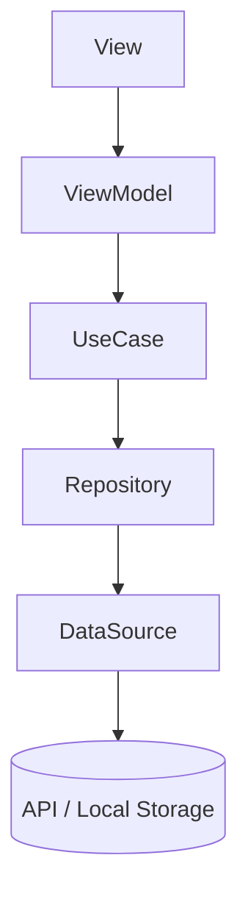

# mergeBox 

## アプリ概要

mergeBox は、実装実験や機能検証を目的とした個人開発アプリである。
SwiftUI を中心に、状態駆動の画面遷移と Clean Architecture を組み合わせた構成を採用している。

---

## アーキテクチャ概要



本アーキテクチャは、状態駆動（State-Driven）Navigation と
Feature 単位の垂直スライス構成を基本とする。

---

## フォルダ構成（Feature単位）

```bash
AppMain/
 ├── DI/
 │    └── AppDIContainer.swift        // 依存関係を生成・注入
 └── AppEntry.swift                   // アプリのエントリポイント
 |
Features/
 ├── UserList/
 │    ├── Presentation/               # UI層
 │    │    ├── UserListView.swift
 │    │    ├── UserListViewModel.swift
 │    │    └── UserListCoordinator.swift
 │    ├── Domain/                     # ビジネスロジック層
 │    │    ├── UseCase/
 │    │    │    └── FetchUserListUseCase.swift
 │    │    └── Repository/
 │    │         └── UserRepositoryProtocol.swift
 │    └── Data/                       # データアクセス層
 │         ├── Repository/
 │         │    └── UserRepositoryImpl.swift
 │         ├── DataSource/
 │         │    ├── APIDataSource.swift
 │         │    └── LocalDataSource.swift
 │         ├── DTO/
 │         │    └── UserDTO.swift
 │         └── Mapper/
 │              └── UserMapper.swift
 │
 ├── UserDetail/
 │    ├── Presentation/
 │    │    └── UserDetailView.swift
 │    └── Domain/
 │         └── Model/
 │              └── User.swift
 │
 └── Common/
 │     ├── Components/
 │     └── Extensions/
 │ 
Utility/
 ├── Logger.swift
 └── Extensions
 │     └── Date+Format.swift
 |
Resource/
 ├── Asset+Color.swift
 ├── Asset+Image.swift
 └── Localizable.strings
```

---

## 各ディレクトリの責務

| ディレクトリ        | 役割                                       |
| ------------- | ---------------------------------------- |
| **AppMain/**  | アプリケーション全体のエントリポイントおよび依存性注入を担う           |
| **Features/** | 各機能を縦割りで構成し、UI・Domain・Data 層を1単位として完結させる |
| **Common/**   | 共通 UI コンポーネントや拡張機能を管理する                  |
| **Utility/**  | ロガーや共通処理など、全体で利用される機能を保持する               |
| **Resource/** | 色・画像・ローカライズ文字列などの静的リソースを格納する             |

---

## Coordinator の概要

`NavigationStack` の `path` を状態として扱い、
状態遷移に基づいて画面遷移を制御する仕組みである。
UIKit における `UINavigationController` の責務を SwiftUI 流に抽象化している。

各 Feature に専用の **Coordinator** を用意し、
画面遷移を一元的に管理する。

### 実装例

```swift
@MainActor
final class UserListCoordinator: ObservableObject {
    @Published var path = NavigationPath()

    enum Route: Hashable {
        case userDetail(User)
    }

    func push(_ route: Route) {
        path.append(route)
    }

    func pop() {
        path.removeLast()
    }

    func popToRoot() {
        path = NavigationPath()
    }
}
```

ViewModel からは、Coordinator のメソッドを呼び出すことで状態遷移を発生させる。

```swift
coordinator.push(.userDetail(user))
```

Coordinator は画面遷移の状態のみを保持し、UIロジックを持たない。
これにより、画面構成とビジネスロジックを明確に分離できる。

---

## 依存性注入の流れ

```
[View] → [ViewModel]
     ↳ FetchUseCase
          ↳ RepositoryProtocol
               ↳ RepositoryImpl
                    ↳ DataSource(API / Local)
```

全ての依存関係は `AppDIContainer` により生成・注入される。
依存の入れ替えが容易であり、Mock を用いたテストにも適している。

---

## AppDIContainer の構成例

```swift
final class AppDIContainer {
    static let shared = AppDIContainer()
    private init() {}

    // MARK: - DataSource
    private let apiDataSource = APIDataSource()
    private let localDataSource = LocalDataSource()

    // MARK: - Repository
    private func makeUserRepository() -> UserRepositoryProtocol {
        UserRepositoryImpl(api: apiDataSource, local: localDataSource)
    }

    // MARK: - UseCase
    private func makeFetchUserListUseCase() -> FetchUserListUseCaseProtocol {
        FetchUserListUseCase(repository: makeUserRepository())
    }

    // MARK: - Coordinator
    private let userListCoordinator = UserListCoordinator()

    // MARK: - View
    func makeUserListView() -> some View {
        let vm = UserListViewModel(
            fetchUsersUseCase: makeFetchUserListUseCase(),
            coordinator: userListCoordinator
        )
        return UserListView(viewModel: vm, coordinator: userListCoordinator)
    }
}
```

---

## Mapper の役割

DTO（外部データ）をアプリ内部で利用可能な Model へ変換する責務を持つ。
RepositoryImpl の責務を軽減し、データ変換ロジックを一元管理する。

```swift
// DTO
struct UserDTO: Decodable {
    let id: Int
    let user_name: String
}

// Model
struct User: Identifiable {
    let id: Int
    let name: String
}

// Mapper
struct UserMapper {
    static func map(dto: UserDTO) -> User {
        User(id: dto.id, name: dto.user_name)
    }
}
```

DTO は API 仕様に依存し、Model はアプリケーション内部仕様に依存する。
Mapper はその橋渡しを行う層である。

---

## テスト方針

| 対象              | テスト内容                                 |
| --------------- | ------------------------------------- |
| **UseCase**     | MockRepository を用いてビジネスロジックを単体検証する    |
| **Repository**  | MockDataSource を使用し、外部通信に依存しない検証を行う   |
| **Coordinator** | `path` の状態変化を監視し、遷移の妥当性を確認する          |
| **ViewModel**   | UseCase・Coordinator をモック化し、状態遷移をテストする |

---

## Quick Start

```bash
# 1. プロジェクトを開く
open MergeBox.xcodeproj

# 2. 実行
⌘ + R
```

---

## Feature自動生成コマンド

コマンド実行により、Presentation・Domain・Data層の各ディレクトリが一括で作成される。

```makefile
FEATURES_DIR = ./Features

feature:
	@if [ -z "$(NAME)" ]; then \
	  echo "Usage: make feature NAME=FeatureName"; \
	  exit 1; \
	fi
	mkdir -p $(FEATURES_DIR)/$(NAME)/Presentation
	mkdir -p $(FEATURES_DIR)/$(NAME)/Domain/UseCase
	mkdir -p $(FEATURES_DIR)/$(NAME)/Domain/Repository
	mkdir -p $(FEATURES_DIR)/$(NAME)/Data/Repository
	mkdir -p $(FEATURES_DIR)/$(NAME)/Data/DataSource
	mkdir -p $(FEATURES_DIR)/$(NAME)/Data/DTO
	mkdir -p $(FEATURES_DIR)/$(NAME)/Data/Mapper
	@echo "✅ Created feature: $(FEATURES_DIR)/$(NAME)"
```

## 実行方法

```bash
make feature NAME=SampleFeature
```

## 生成結果

```
Features/
└── SampleFeature/
    ├── Presentation/
    ├── Domain/
    │   ├── UseCase/
    │   └── Repository/
    └── Data/
        ├── Repository/
        ├── DataSource/
        ├── DTO/
        └── Mapper/
```

### 補足事項

* `NAME` に指定した値がFeature名として使用される
* 既存フォルダが存在する場合は上書きせずスキップされる
* macOSおよびLinux環境で動作（Xcodeプロジェクトのルートで実行すること）

---

## 使用ライブラリ一覧

すべて Swift Package Manager（SPM）で管理する。

| ライブラリ名        | 用途       | 備考              |
| ------------- | -------- | --------------- |
| **Alamofire** | HTTP 通信  | API クライアントとして利用 |
| **Logger**    | デバッグログ出力 | Utility 層で利用    |

---

## 技術構成

| 項目      | 内容                                   |
| ------- | ------------------------------------ |
| 言語      | Swift 5.10+                          |
| UI      | SwiftUI                              |
| 通信      | Alamofire                            |
| DI      | 独自 DI コンテナ（AppDIContainer）           |
| アーキテクチャ | Clean Architecture + 状態駆動 Navigation |
| 構成方式    | Feature 単位（垂直スライス）                   |
| 対応 OS   | iOS 17.0+                            |
| 依存管理    | Swift Package Manager (SPM)          |

---

## まとめ

| 項目               | 内容                                    |
| ---------------- | ------------------------------------- |
| **Feature 単位構成** | UI から Data 層までを一機能で完結させる構成            |
| **状態駆動の画面遷移**    | Coordinator により NavigationStack を制御する |
| **明確な依存関係**      | AppDIContainer に依存注入を集約し、テスト容易性を確保    |
| **高い保守性**        | 機能単位で独立した開発・改修が可能                     |
| **チーム開発適性**      | 各 Feature が分離され、複数人開発でも衝突が少ない         |

---

## 結論

mergeBox のアーキテクチャは、
**状態駆動の遷移制御** と **Clean Architecture** を統合した、
SwiftUI 向けのモジュール分離指向構成
Feature 単位構成により、保守性・拡張性・テスト容易性のすべてを両立する
