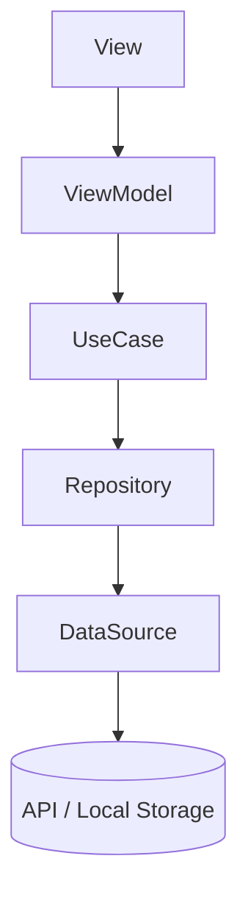

# 🧱 SwiftUI Clean Architecture Template

> 🎯 個人開発・中規模アプリ向けの軽量クリーンアーキテクチャ構成  
> Infra層を省略し、Data層でAPIやDBアクセスを行う現実的な設計

---

## 🗺️ アーキテクチャ概要



---

## 🚀 Quick Start

```bash
# 1. プロジェクトを開く
open MyApp.xcodeproj

# 2. 実行
⌘ + R
```

---

## 🧱 フォルダ構成

```
AppMain/
 └── DI/
      └── AppDIContainer.swift        // 依存関係を生成・注入

UI層/
 └── [FeatureName]/
      ├── [FeatureName]View.swift
      └── [FeatureName]ViewModel.swift

Domain層/
 ├── Model/
 │    ├── User.swift
 │    └── Article.swift
 ├── Repository/
 │    ├── UserRepositoryProtocol.swift
 │    └── ArticleRepositoryProtocol.swift
 └── UseCase/
      ├── FetchUserUseCase.swift
      └── FetchArticlesUseCase.swift

Data層/
 ├── DTO/
 │    ├── UserDTO.swift
 │    └── ArticleDTO.swift
 ├── DataSource/
 │    ├── APIDataSource.swift
 │    └── UserDefaultsDataSource.swift
 ├── Repository/
 │    ├── UserRepositoryImpl.swift
 │    └── ArticleRepositoryImpl.swift
 └── Mapper/
      ├── UserMapper.swift
      └── ArticleMapper.swift

Utility/
 ├── Logger.swift
 └── Extensions/
      └── Date+Format.swift

Resource/
 ├── Asset+Color.swift
 ├── Asset+Image.swift
 └── Localizable.strings
```

---

## 🧠 各層の概要

| 層 | 目的 | 例 |
|----|------|----|
| **UI層** | 画面描画と状態管理 | SwiftUI View / ViewModel |
| **Domain層** | ビジネスロジックとルール定義 | UseCase, RepositoryProtocol, Model |
| **Data層** | API通信・データ保存・変換 | RepositoryImpl, DataSource, Mapper, DTO |
| **Utility層** | 共通機能やロガー | Logger, Extensions |

---

## 💉 依存性注入の流れ

```
[View] → [ViewModel]
     ↳ FetchUseCase
          ↳ RepositoryProtocol
               ↳ RepositoryImpl
                    ↳ DataSource(API / Local)
```

全ての依存関係は `AppDIContainer` で生成・注入される。  
テストやMock差し替えが容易。

---

## 🧩 AppDIContainerサンプル

```swift
final class AppDIContainer {
    static let shared = AppDIContainer()
    private init() {}

    // MARK: - DataSource
    private let apiDataSource = APIDataSource()
    private let localDataSource = UserDefaultsDataSource()

    // MARK: - Repository
    private func makeUserRepository() -> UserRepositoryProtocol {
        UserRepositoryImpl(api: apiDataSource, local: localDataSource)
    }

    // MARK: - UseCase
    private func makeFetchUserUseCase() -> FetchUserUseCaseProtocol {
        FetchUserUseCase(repository: makeUserRepository())
    }

    // MARK: - ViewModel
    func makeDashboardViewModel() -> DashboardViewModel {
        DashboardViewModel(fetchUserUseCase: makeFetchUserUseCase())
    }
}
```

---

## 🧠 Mapperの役割

- **目的**：DTO（外部データ）をModel（アプリ内部データ）へ変換  
- **効果**：RepositoryImplをシンプル化・テスト容易化  

```swift
// DTO
struct UserDTO: Decodable {
    let id: Int
    let user_name: String
}

// Model
struct User: Identifiable {
    let id: Int
    let name: String
}

// Mapper
struct UserMapper {
    static func map(dto: UserDTO) -> User {
        User(id: dto.id, name: dto.user_name)
    }
}
```

---

## 🧩 テスト方針

- **UseCase単体テスト**  
  MockRepositoryを注入してロジックを検証  
- **Repositoryテスト**  
  DataSourceのMockを用いて通信依存を排除

---

## ⚙️ 技術構成

| 項目 | 使用技術 |
|------|-----------|
| 言語 | Swift 5.10+ |
| UI | SwiftUI |
| 通信 | URLSession / （必要に応じてAlamofire） |
| DI | 独自DIコンテナ（AppDIContainer） |
| アーキテクチャ | Clean Architecture（軽量構成） |
| 対応OS | iOS 17.0+ |
| 依存管理 | Swift Package Manager (SPM) |


---

## 💬 まとめ

| 長所 | 内容 |
|------|------|
| **軽量構成** | 不要なInfra層を省略し、シンプルな構成 |
| **テストが容易** | DIコンテナでMock差し替えが容易 |
| **保守性** | 各層が明確に分離され保守性が高い |
